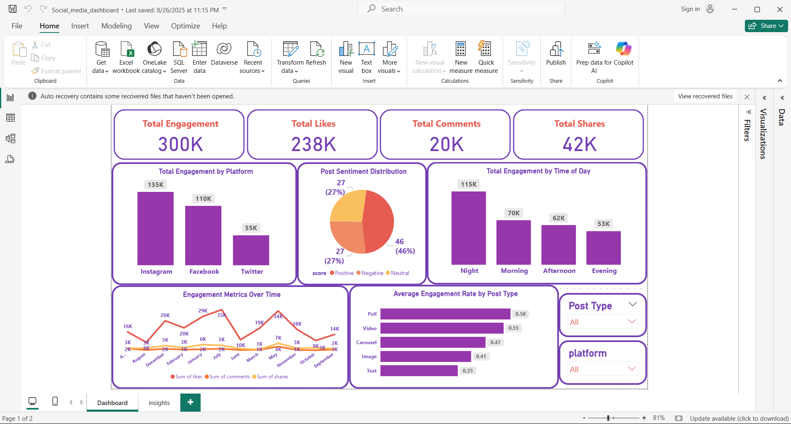

# Social Media Data Analysis Project

## Project Overview
This project focuses on analyzing social media performance data to uncover insights into user engagement, content performance, and platform effectiveness.  
The analysis was performed using **SQL**, **Python**, **Power Query**, and **Power BI**, resulting in an interactive and visually compelling dashboard.

## Objectives
- Clean and prepare raw social media data for analysis.
- Identify engagement trends across multiple platforms.
- Analyze sentiment distribution in posts.
- Compare engagement by post type and time of day.
- Build an interactive Power BI dashboard to visualize insights.

## Tools & Technologies
| Tool / Language | Purpose |
|------------------|----------|
| **SQL** | Data extraction, aggregation, and querying from databases |
| **Python (Pandas, Matplotlib, Seaborn)** | Data preprocessing, exploratory data analysis (EDA), and trend visualization |
| **Power Query** | Data cleaning and transformation within Power BI |
| **Power BI** | Building the interactive dashboard for data visualization and reporting |

## Data Preparation
1. **Data Cleaning (Power Query)**
   - Removed duplicates and null values.
   - Standardized column names and data types.
   - Handled missing values and formatting inconsistencies.

2. **Data Analysis (SQL & Python)**
   - SQL queries were used to aggregate data such as total likes, shares, and comments.
   - Python was used for deeper analysis including:
     - Time-based engagement trends.
     - Sentiment analysis (Positive, Negative, Neutral).
     - Engagement rate calculations.
    
## Dashboard Features
- **Total Engagement Metrics:** Displays total likes, comments, and shares.  
- **Platform Performance:** Comparison of engagement across Instagram, Facebook, and Twitter.  
- **Post Sentiment Distribution:** Pie chart showing sentiment analysis of posts.  
- **Engagement by Time of Day:** Bar chart comparing morning, afternoon, evening, and night engagement.  
- **Engagement Over Time:** Line chart showing monthly engagement trends.  
- **Engagement Rate by Post Type:** Bar chart ranking different post types (Polls, Videos, Carousels, etc.).  
- **Interactive Filters:** Allows filtering by platform and post type.

## Insights Derived
- **Instagram** had the highest engagement (135K), followed by **Facebook** (110K).  
- **Posts at night** had the highest engagement rate.  
- **Positive sentiment** posts made up the majority (46%) of all posts.  
- **Polls and videos** were the most engaging post types.

## Author
Created by [Nourhan Adel] — 2025
